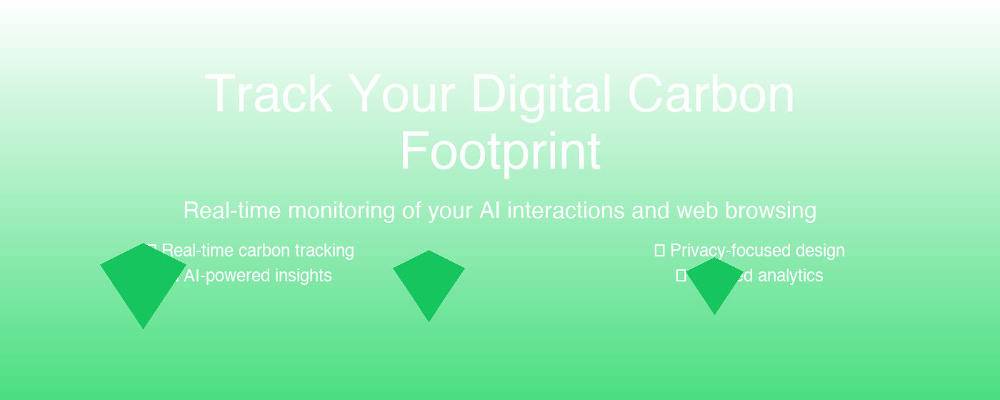
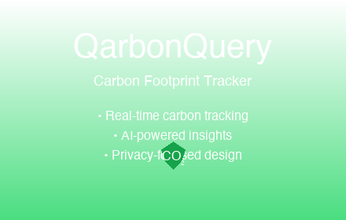
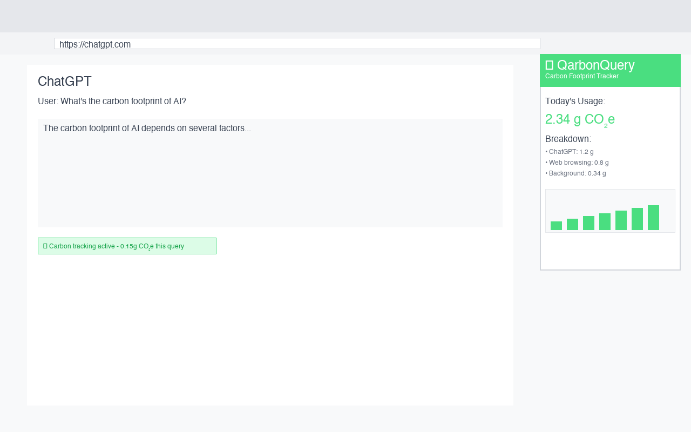

# Qarbon Query - Chrome Web Store Submission Assets

## 📦 Complete Store Submission Package

This directory contains all the deliverables needed for submitting **Qarbon Query Carbon Footprint Tracker v1.1.0** to the Chrome Web Store.

---

## 🎯 Quick Overview

**Qarbon Query** is a privacy-first carbon footprint tracker that helps users understand and reduce the environmental impact of their web browsing through real-time emissions data and sustainability insights.

### 🌟 Core Features
- Real-time CO₂e tracking per website
- 14-day, 7-day, and 30-day trend charts
- Category breakdown and daily goals
- Privacy-first design with local data storage
- One-click CSV export and settings panel

---

## 📋 Assets Inventory

### 🎨 Visual Assets
| Asset | File | Specifications | Preview |
|-------|------|---------------|---------|
| **Banner** | [`banner.png`](banner.png) | 1400×560px |  |
| **Tile** | [`tile.png`](tile.png) | 440×280px |  |
| **Icon Set** | [`icons/`](icons/) | 16×16, 32×32, 48×48, 128×128 |  |

### 📱 Screenshots
| Screenshot | File | Dimensions | Description |
|------------|------|------------|-------------|
| **Main Dashboard** | [`screenshots/screenshot-1-1280x800.png`](screenshots/screenshot-1-1280x800.png) | 1280×800px |  |
| **Settings Panel** | [`screenshots/screenshot-2-640x400.png`](screenshots/screenshot-2-640x400.png) | 640×400px |  |

---

## 📝 Store Listing Content

### 📄 Store Descriptions

#### Short Description
**File:** [`listing_short.txt`](listing_short.txt)
```
Track and reduce your web browsing carbon footprint with real-time emissions data and sustainability insights.
```

#### Key Features
**File:** [`listing_features.md`](listing_features.md)
- Real-time CO₂e tracking per site
- 14-/7-/30-day trend charts
- Category breakdown & daily goals
- Privacy-first, data stored locally
- One-click CSV export & settings panel

#### Detailed Description
**File:** [`listing_long.md`](listing_long.md)
- Comprehensive product overview
- How it works explanation
- Key features breakdown
- Target audience details
- FAQ section
- Version 1.1.0 changelog

---

## 🔒 Legal & Compliance

### Privacy Policy
**File:** [`privacy-policy.html`](privacy-policy.html)
- Complete privacy policy for Chrome Web Store
- GDPR and CCPA compliance
- Clear data usage explanation
- Contact information for privacy concerns

---

## 📦 Technical Deliverables

### Extension Package
**File:** [`qarbonquery-carbon-tracker-1.1.0.zip`](qarbonquery-carbon-tracker-1.1.0.zip)
- Complete Chrome extension package
- Ready for upload to Chrome Web Store
- Version 1.1.0 with all features
- **Size:** ~190KB
- **Includes:** Manifest v3, background scripts, content scripts, UI components

### Submission Checklist
**File:** [`submission_checklist.md`](submission_checklist.md)
- Complete pre-submission checklist
- Store policy compliance verification
- Technical requirements confirmation
- Asset validation checklist

---

## 🎯 Chrome Web Store Requirements Compliance

### ✅ Visual Assets
- [x] **Banner:** 1400×560px PNG ✓
- [x] **Tile:** 440×280px PNG ✓
- [x] **Icons:** 16×16, 32×32, 48×48, 128×128 PNG ✓
- [x] **Screenshots:** 1280×800px and 640×400px PNG ✓

### ✅ Listing Content
- [x] **Short Description:** Under 132 characters ✓
- [x] **Detailed Description:** Comprehensive with features ✓
- [x] **Key Features:** Bullet-point format ✓
- [x] **Category:** Productivity/Sustainability ✓

### ✅ Technical Requirements
- [x] **Manifest V3:** Compliant ✓
- [x] **Permissions:** Minimal and justified ✓
- [x] **CSP:** Strict content security policy ✓
- [x] **Privacy Policy:** Complete and accessible ✓

### ✅ Store Policies
- [x] **Single Purpose:** Carbon footprint tracking ✓
- [x] **Privacy:** Local data storage, no tracking ✓
- [x] **User Data:** Transparent usage disclosure ✓
- [x] **Functionality:** Full-featured and tested ✓

---

## 🚀 Submission Process

### 1. Developer Dashboard Setup
1. Access [Chrome Web Store Developer Dashboard](https://chrome.google.com/webstore/devconsole)
2. Create new item or update existing
3. Upload `qarbonquery-carbon-tracker-1.1.0.zip`

### 2. Store Listing Configuration
1. **Product Details:**
   - Name: "Qarbon Query - Carbon Footprint Tracker"
   - Category: Productivity
   - Language: English (US)

2. **Visual Assets:**
   - Upload `banner.png` as store listing banner
   - Upload `tile.png` as promotional tile
   - Upload screenshots from `screenshots/` folder
   - Upload all icons from `icons/` folder

3. **Description & Content:**
   - Copy content from `listing_short.txt` for summary
   - Copy content from `listing_long.md` for detailed description
   - Copy features from `listing_features.md`

4. **Privacy & Compliance:**
   - Link to hosted `privacy-policy.html`
   - Declare permissions usage
   - Complete store policy compliance

### 3. Pre-Submission Verification
Review and complete all items in [`submission_checklist.md`](submission_checklist.md)

---

## 📊 Asset Specifications Summary

| Asset Type | Count | Total Size | Format |
|------------|-------|------------|---------|
| Icons | 5 files | ~2KB | PNG |
| Screenshots | 2 files | ~65KB | PNG |
| Banner/Tile | 2 files | ~58KB | PNG |
| Extension Package | 1 file | ~190KB | ZIP |
| Documentation | 5 files | ~15KB | TXT/MD/HTML |
| **Total** | **15 files** | **~330KB** | **Mixed** |

---

## 🔗 Quick Links

- [Extension Package](qarbonquery-carbon-tracker-1.1.0.zip) - Ready for upload
- [Privacy Policy](privacy-policy.html) - For hosting
- [Submission Checklist](submission_checklist.md) - Pre-submission verification
- [Chrome Web Store Developer Dashboard](https://chrome.google.com/webstore/devconsole)
- [Chrome Web Store Policies](https://developer.chrome.com/webstore/program-policies)

---

## 📞 Support

For questions about this submission package:
- **Email:** support@qarbon.dev
- **Documentation:** [Chrome Extension Developer Guide](https://developer.chrome.com/docs/extensions/)
- **Store Policy:** [Chrome Web Store Program Policies](https://developer.chrome.com/webstore/program-policies)

---

*Generated on: July 4, 2024*  
*Package Version: 1.1.0*  
*Submission Ready: ✅*
